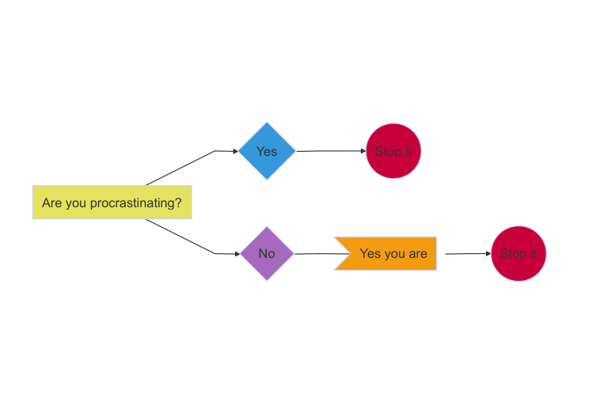
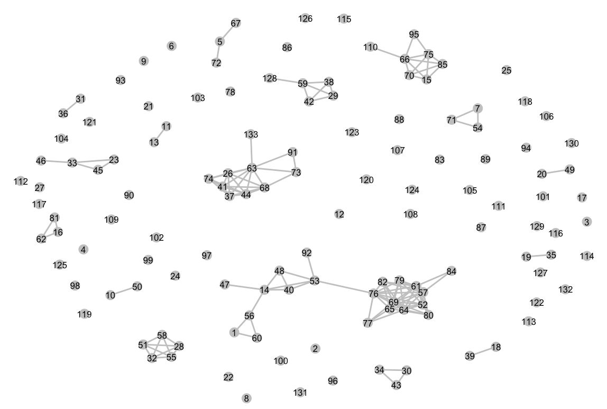
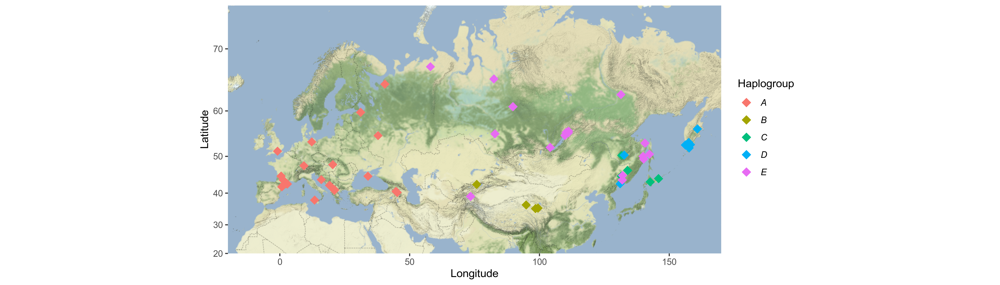
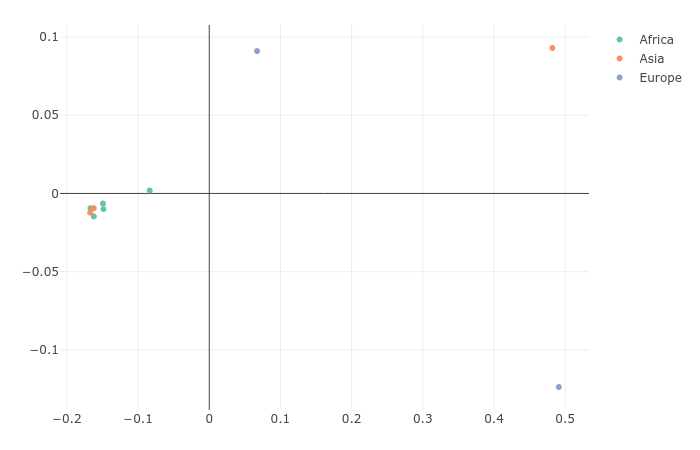
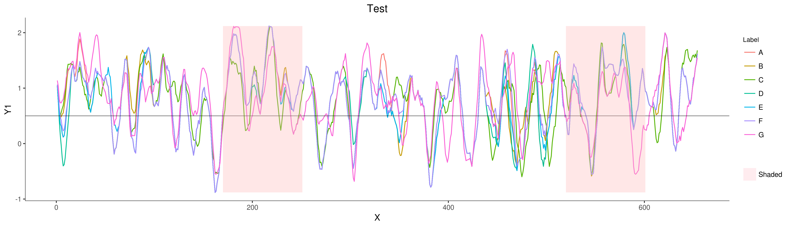
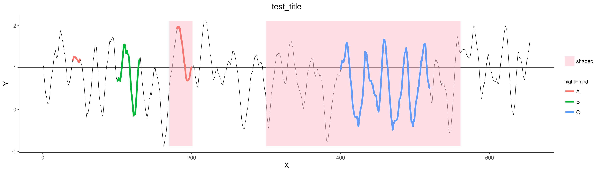
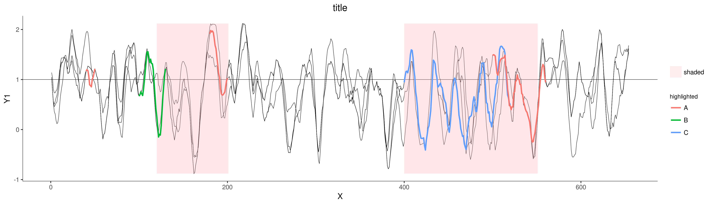
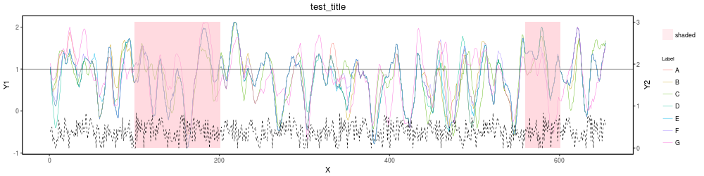
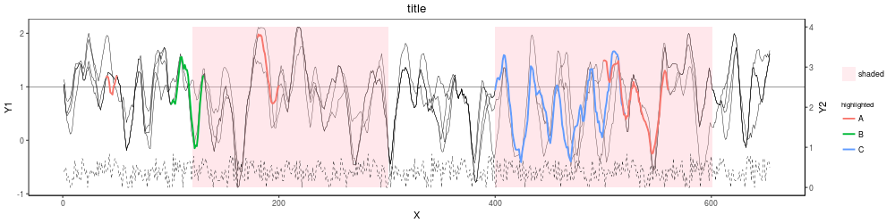

# Data visualisation 

     

## Flow chart 

     
     
     

## Network of associations

     
     
     

## Haplogroup distribution plot:

     

     

     

## Interactive MDS genetic distance plot.

 

     

     

     

## Shaded line plot:

     

     

     

## Highlighted and shaded line plot:

     

     

     

## Highlighted and shaded multi-line:

     

     

     

## Dual axis shaded plot:

     

     

     

## Dual axis highlighted and shaded:

     

     

     

