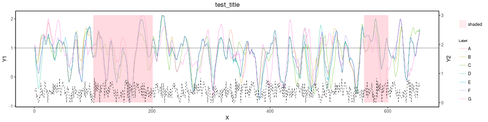

- Dual axis line plot 
- Data must be in the same format as test_y1.csv and test_y2.csv
- requires ggplot2, grid, gtable         

              
         
         USAGE:  dual_axis_shaded.R   test_y1.csv   test_y2.csv   test_title   1   shaded   170:250,520:600   test.png

     

