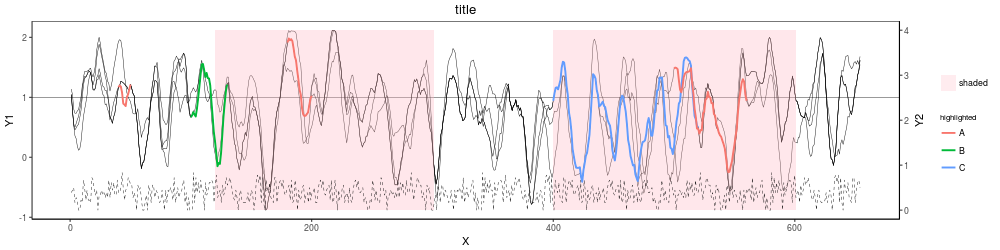

Plots:

-Two Y axes

-Shaded region

-Highlighted regions per line      

     Example: ./dual_highlighted_and_shaded.R  test_Y1.csv  test_Y2.csv  test.txt  highlighted  shaded  title  1  120:300,400:600  test.png

     

