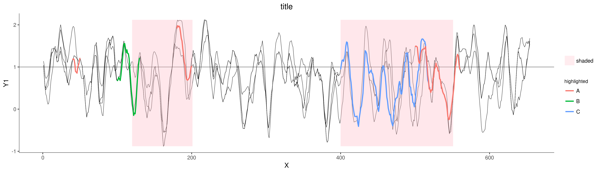

-Plots highlighted regions on top of data per line for multiple lines (see test.txt format)

-Requires ggplot2      

	Example ./highlighted_multiple.R   test.csv   test.txt   highlighted   shaded   title  1  120:200,400:550  test.png

     

